# LANCE Full Setup Guide (Fresh Ubuntu 26.04 → Running Simulation)

This guide takes you from a **brand-new Ubuntu 26.04 install** to a machine that can **build and run the LANCE code and the Gazebo simulation**. It assumes little or no Linux experience, so it explains every step.

When you're done, you will have:

- **VS Code** for editing code
- **Foxglove** for viewing robot data and controlling the robot
- **NVIDIA graphics drivers**, if your computer has an NVIDIA GPU
- **Distrobox**: an Ubuntu **24.04** "container" running on your Ubuntu 26.04 computer
- **ROS 2 Jazzy** and **Gazebo**, installed inside that container
- The **LANCE code** (plus the `csm-sim` simulation assets), built and ready to run

> [!NOTE]
> **Why a container?** ROS 2 Jazzy and Gazebo only officially support Ubuntu **24.04**, but your computer runs **26.04**. Distrobox gives us a lightweight Ubuntu 24.04 environment inside your normal system. It shares your home folder, your screen, and your GPU, so it feels like part of your computer, but ROS lives inside it.

---

## Table of Contents

0. [Linux Basics You'll Need](#0-linux-basics-youll-need)
1. [Update the System and Install Git](#1-update-the-system-and-install-git)
2. [Install VS Code](#2-install-vs-code)
3. [Install Foxglove](#3-install-foxglove)
4. [Install NVIDIA Drivers](#4-install-nvidia-drivers-nvidia-gpus-only)
5. [Install Distrobox and Podman](#5-install-distrobox-and-podman)
6. [Let Containers Use Your NVIDIA GPU](#6-let-containers-use-your-nvidia-gpu-nvidia-gpus-only)
7. [Create the Ubuntu 24.04 Container](#7-create-the-ubuntu-2404-container)
8. [Customize Your Terminal Prompt](#8-customize-your-terminal-prompt)
9. [Enter the Container for the First Time](#9-enter-the-container-for-the-first-time)
10. [Install ROS 2 Jazzy in the Container](#10-install-ros-2-jazzy-in-the-container)
11. [Download the LANCE Code](#11-download-the-lance-code)
12. [Install Project Dependencies (and Gazebo)](#12-install-project-dependencies-and-gazebo)
13. [Build the Project](#13-build-the-project)
14. [Run the Simulation](#14-run-the-simulation)
15. [Everyday Workflow Cheat Sheet](#15-everyday-workflow-cheat-sheet)
16. [Troubleshooting](#16-troubleshooting)

---

## 0. Linux Basics You'll Need

Skip this section if you're comfortable with the terminal.

### The terminal
Most of this guide runs commands in the **terminal**, a text window where you type commands and press **Enter**. To open one, press **`Ctrl` + `Alt` + `T`**, or press the **Super** (Windows) key, type `terminal`, and press Enter.

### Copying and pasting
- **Paste into the terminal:** `Ctrl` + `Shift` + `V` (plain `Ctrl` + `V` does **not** work)
- **Copy from the terminal:** highlight the text, then press `Ctrl` + `Shift` + `C`
- In this guide, you can copy a whole code block and paste it at once. Commands split across several lines with a `\` at the end of each line count as **one** command.

### `sudo` and your password
Commands starting with **`sudo`** run as administrator, and the terminal asks for **your login password**. **Nothing appears on screen while you type the password** (no dots, no stars). That's normal: type it and press Enter.

### "Do you want to continue? [Y/n]"
When installing software, the terminal often asks for confirmation. Type **`y`** and press **Enter**. The capital letter is the default, so pressing Enter alone also works.

### Reading the prompt
The text before your cursor is the **prompt**. It tells you who and where you are:
```
samri@samri-Precision-5540:~/Downloads$
└─user─┘ └───computer name───┘ └─folder─┘
```
`~` is shorthand for your **home folder** (for example `/home/samri`).

### Where to run each command
This guide uses two kinds of terminals, and each section is labeled with one:

| Label | Meaning | Prompt looks like |
| - | - | - |
| 🖥️ **HOST** | A normal terminal on your Ubuntu 26.04 computer | `user@computer:~$` |
| 📦 **CONTAINER** | A terminal *inside* the Ubuntu 24.04 distrobox | `[BOX:ros-jazzy] user@computer:~$` |

(You'll set up the `[BOX:ros-jazzy]` marker in [step 8](#8-customize-your-terminal-prompt).)

### Useful keys
- **`Ctrl` + `C`**: stop the command that's currently running
- **`Tab`**: autocomplete file and folder names (press it often; it saves typos)
- **`↑` arrow**: bring back the previous command

---

## 1. Update the System and Install Git

🖥️ **HOST**

Open a terminal and run each command below. These commands refresh the list of available software, install any updates, and install `git`, the tool used to download the code.

```bash
sudo apt update
sudo apt upgrade
sudo apt install git
```

<details>
<summary>📷 Example output of <code>sudo apt update</code></summary>

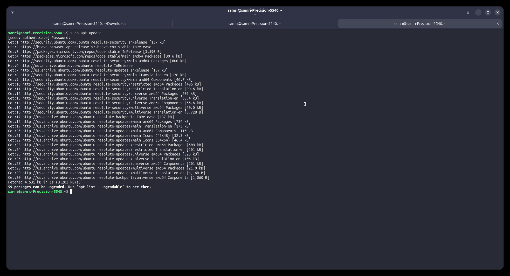

</details>

> [!TIP]
> If `apt upgrade` installed many updates (especially anything with "linux" or "kernel" in the name), restart your computer before continuing.

---

## 2. Install VS Code

🖥️ **HOST**

VS Code is the code editor we use. It runs on the host and can edit the project files directly, because the container shares your home folder.

1. Go to **https://code.visualstudio.com/download** and click the **Debian/Ubuntu** button (under Linux). This downloads a `.deb` file, the Ubuntu equivalent of a Windows installer.

   <details>
   <summary>📷 Screenshot: VS Code download page</summary>

   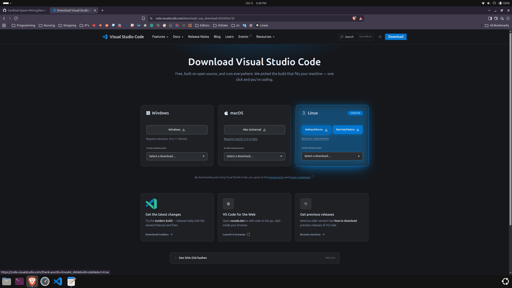

   </details>

2. Open the **Files** app and go to your **Downloads** folder. Click the **⋮** (three dots) menu at the top and choose **Open in Terminal**. This opens a terminal that's already "in" the Downloads folder.

   <details>
   <summary>📷 Screenshot: "Open in Terminal" from the Files app</summary>

   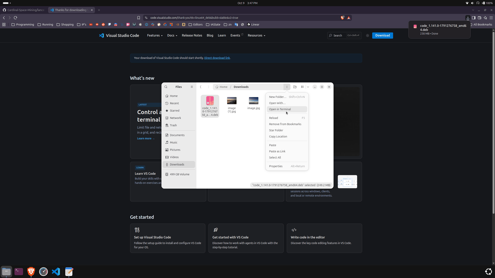

   </details>

   > If you prefer, open a normal terminal and type `cd ~/Downloads` instead.

3. Install the file with `apt`. The exact filename changes with every version, so type `sudo apt install ./code_` and then press **Tab** to autocomplete the rest:
   ```bash
   sudo apt install ./code_<version>_amd64.deb
   ```
   If it asks whether to **add the Microsoft repository**, choose **Yes**. This lets VS Code update itself along with the rest of your system.

   <details>
   <summary>📷 Example output</summary>

   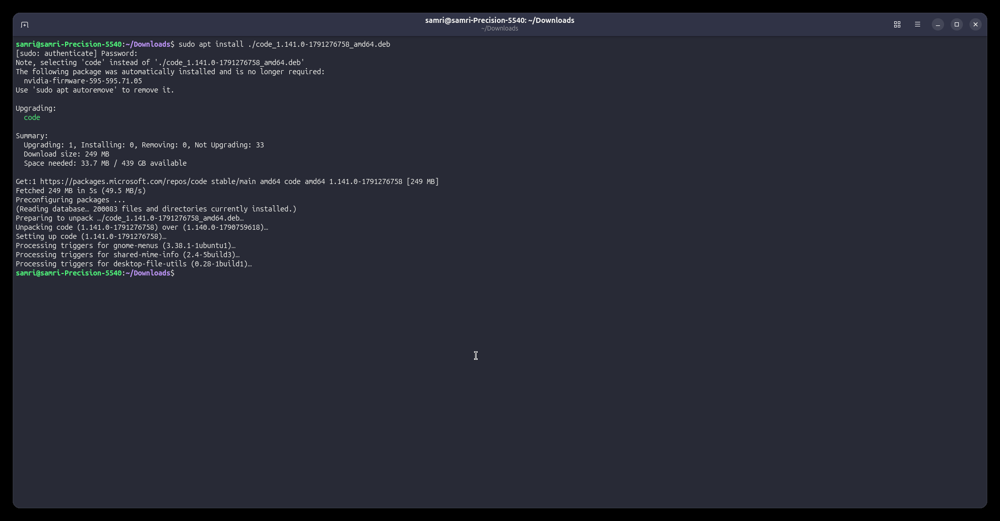

   </details>

4. Launch VS Code by searching for "Visual Studio Code" in the app menu (press Super and type `vscode`), or by typing `code` in a terminal.

   <details>
   <summary>📷 Screenshot: finding VS Code in the app menu</summary>

   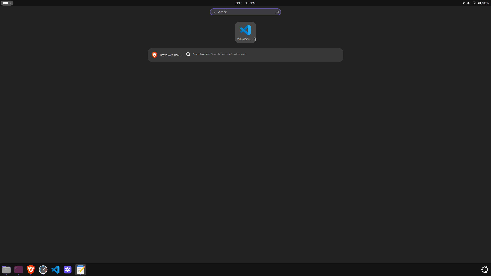

   </details>

---

## 3. Install Foxglove

🖥️ **HOST**

Foxglove is the dashboard used to view sensor data and control the robot, both the real one and the simulated one.

1. Go to **https://foxglove.dev/download**, choose the **Linux** tab, and click **Download x64** (use **arm64** only if you're on an ARM computer, which is rare).

   <details>
   <summary>📷 Screenshot: Foxglove download page</summary>

   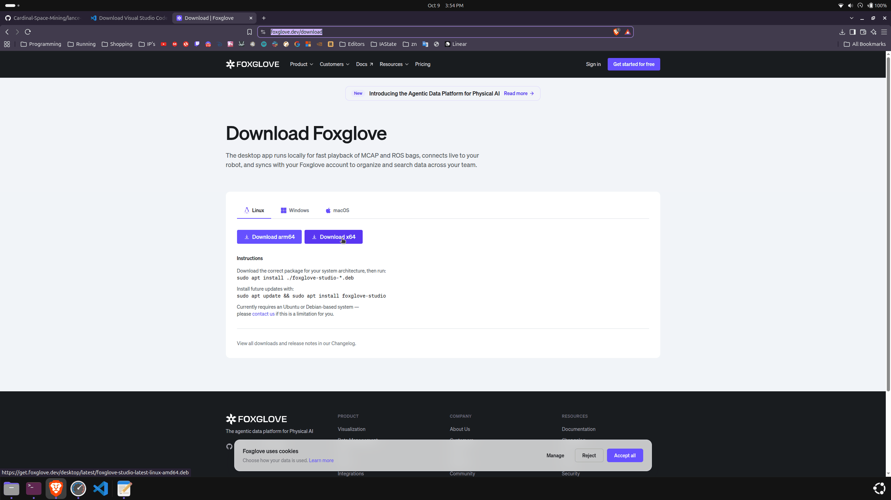

   </details>

2. Open a terminal in your Downloads folder (same as in the VS Code step) and install it:
   ```bash
   sudo apt install ./foxglove-studio-latest-linux-amd64.deb
   ```

   <details>
   <summary>📷 Example output</summary>

   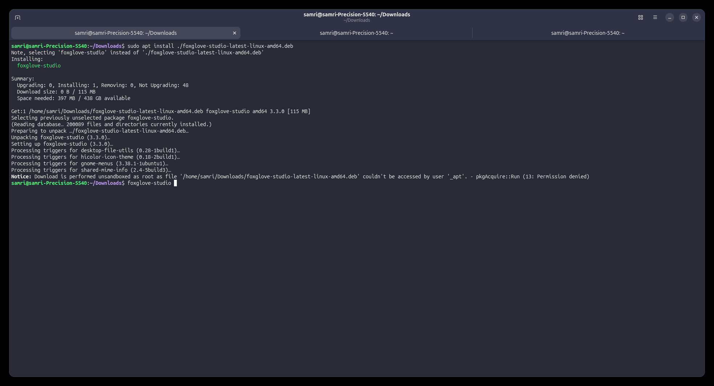

   > The `Notice: Download is performed unsandboxed as root...` line at the end is harmless and can be ignored.

   </details>

3. Open Foxglove from the app menu, or by typing `foxglove-studio` in a terminal.

4. **Sign in or create a free account.** Clicking the button opens your web browser. Confirm that the code shown in the browser matches the code in the app, click **Authorize**, then click **Open Foxglove** to return to the app.

   <details>
   <summary>📷 Screenshots: signing in</summary>

   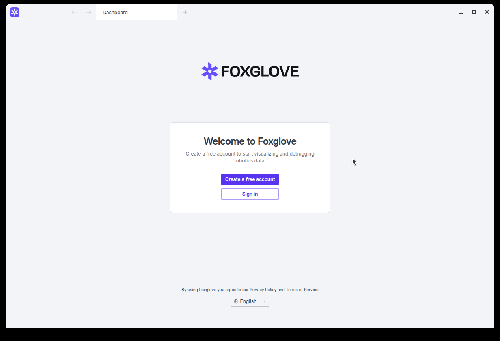

   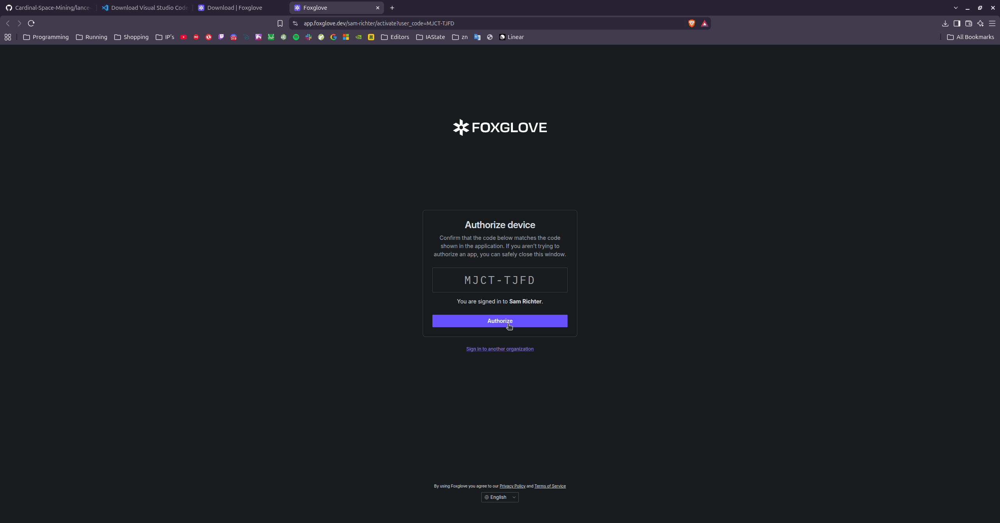

   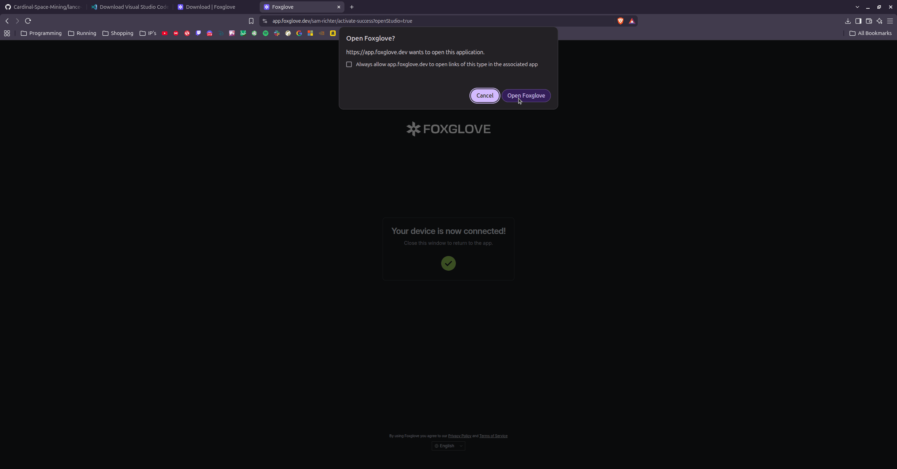

   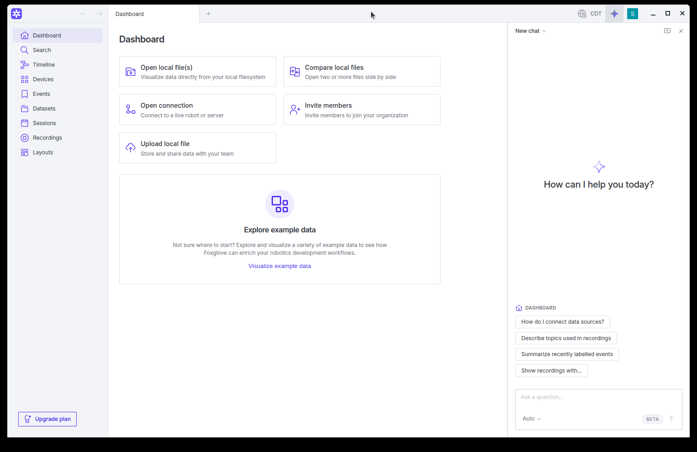

   </details>

5. **Install the required extensions.** Click your profile icon (top-right) and choose **Extensions**. Search for and install each of these:
   - **Bar Display**
   - **Button**
   - **String Panel**

   <details>
   <summary>📷 Screenshot: Extensions menu</summary>

   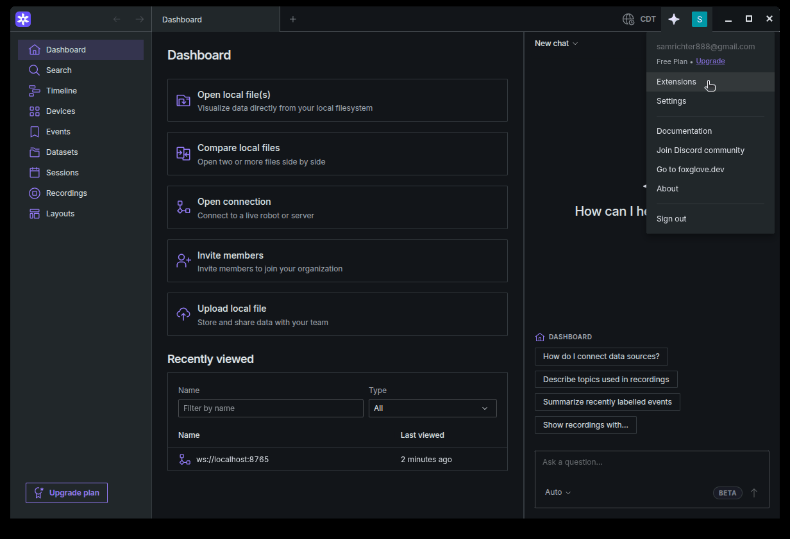

   </details>

---

## 4. Install NVIDIA Drivers (NVIDIA GPUs only)

🖥️ **HOST**

> [!IMPORTANT]
> **No NVIDIA graphics card?** If your computer only has Intel or AMD graphics, **skip this step and [step 6](#6-let-containers-use-your-nvidia-gpu-nvidia-gpus-only)**. In [step 7](#7-create-the-ubuntu-2404-container), use the non-NVIDIA version of the command.
>
> **Not sure?** Run `lspci | grep -i nvidia`. If it prints anything, you have an NVIDIA GPU.

1. **Check whether a driver is already installed.** The Ubuntu installer sometimes installs one for you:
   ```bash
   nvidia-smi
   ```
   If this prints a table showing your GPU (like the screenshot below), you already have a driver and can skip to [step 5](#5-install-distrobox-and-podman). If it says `command not found` or fails, continue.

2. **List the available drivers:**
   ```bash
   ubuntu-drivers list
   ```
   To see which one Ubuntu **recommends** for your GPU, run:
   ```bash
   sudo ubuntu-drivers devices
   ```
   Look for the line ending in **`recommended`**.

3. **Install the driver**, replacing `###` with the version number you chose (for example `595` or `595-open`):
   ```bash
   sudo apt install nvidia-driver-###
   ```
   Choose the **recommended** one. If in doubt, pick the highest-numbered version that does **not** include `server` in its name.

   > [!WARNING]
   > If your computer has **Secure Boot** enabled, the installer may ask you to create a password. On the next reboot you'll see a blue **"MOK management"** screen. Choose **Enroll MOK → Continue → Yes**, and enter that same password. If you skip this, the driver won't load.

4. **Reboot** your computer:
   ```bash
   reboot
   ```

5. **Confirm it works:**
   ```bash
   nvidia-smi
   ```
   You should see a table with your GPU's name, driver version, and memory usage.

<details>
<summary>📷 Example output of <code>ubuntu-drivers list</code> and <code>nvidia-smi</code></summary>

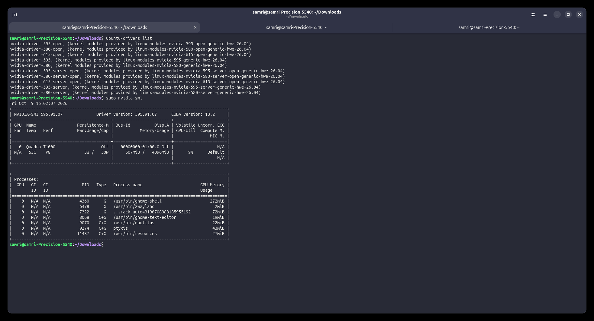

</details>

---

## 5. Install Distrobox and Podman

🖥️ **HOST**

**Podman** is the engine that runs containers, and **Distrobox** is a friendly tool built on top of it that makes containers feel like part of your normal system.

```bash
sudo apt update
sudo apt install -y podman distrobox uidmap
```

(The `-y` flag answers "yes" to the confirmation question automatically.)

Check that both installed correctly. Each command should print a version number:
```bash
podman --version
distrobox --version
podman info
```
`podman info` prints a long block of information. As long as it doesn't show an error, you're good.

<details>
<summary>📷 Example output</summary>

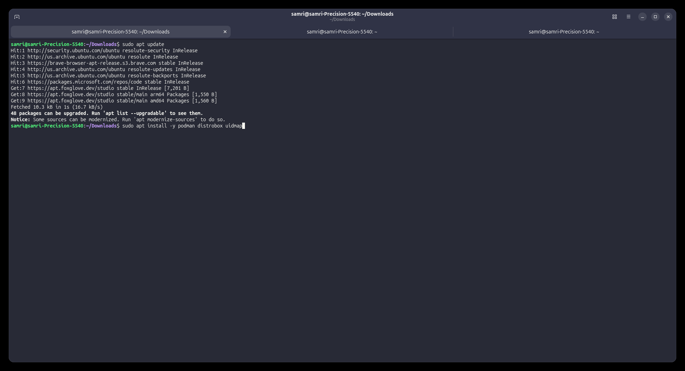

</details>

---

## 6. Let Containers Use Your NVIDIA GPU (NVIDIA GPUs only)

🖥️ **HOST**

> Skip this step if you skipped [step 4](#4-install-nvidia-drivers-nvidia-gpus-only).

By default, containers can't see your graphics card. The **NVIDIA Container Toolkit** fixes that, so Gazebo can use your GPU inside the container and run smoothly.

### 6a. Install the NVIDIA Container Toolkit

First, make sure a few helper tools are installed (they usually already are):
```bash
sudo apt install -y curl ca-certificates gnupg
```

Next, add NVIDIA's software source. Copy and paste each of these two blocks **as a whole**. They don't print anything when they succeed (the second one prints a single line).

```bash
curl -fsSL https://nvidia.github.io/libnvidia-container/gpgkey \
  | sudo gpg --dearmor \
      -o /usr/share/keyrings/nvidia-container-toolkit-keyring.gpg
```

```bash
curl -fsSL \
  https://nvidia.github.io/libnvidia-container/stable/deb/nvidia-container-toolkit.list \
  | sed 's#deb https://#deb [signed-by=/usr/share/keyrings/nvidia-container-toolkit-keyring.gpg] https://#g' \
  | sudo tee /etc/apt/sources.list.d/nvidia-container-toolkit.list
```

> If the first command asks `File ... exists. Overwrite? (y/N)`, type `y` and press Enter.

Then install the toolkit:
```bash
sudo apt update
sudo apt install -y nvidia-container-toolkit
```

<details>
<summary>📷 Example output</summary>

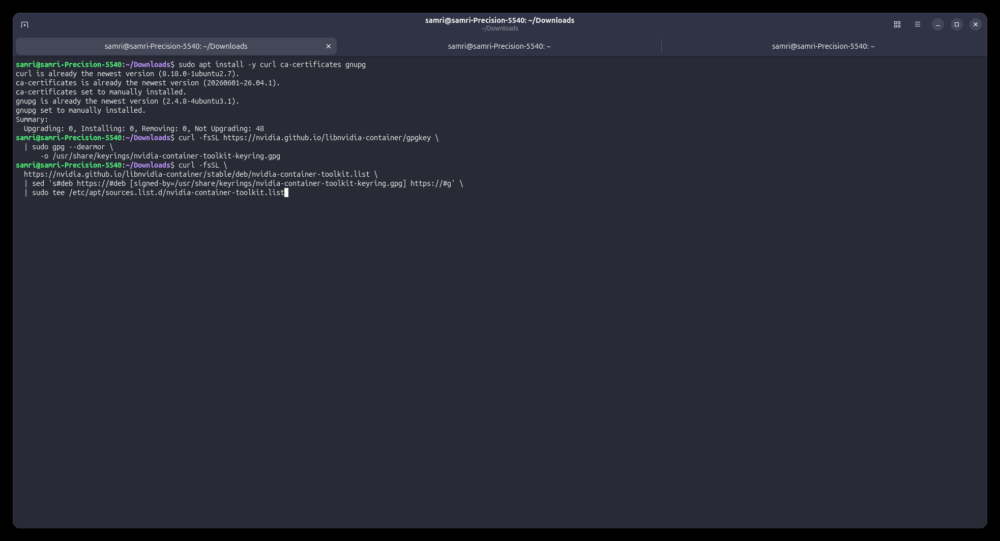

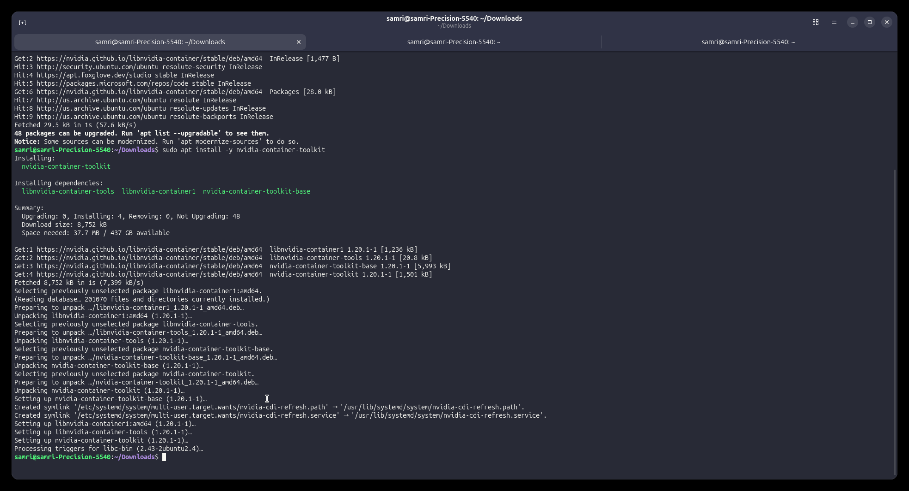

</details>

### 6b. Generate the GPU device description (CDI spec)

This creates a file that tells Podman how to give a container access to your GPU:
```bash
sudo mkdir -p /etc/cdi
sudo nvidia-ctk cdi generate --output=/etc/cdi/nvidia.yaml
```
This prints a **lot** of `INFO` and `WARN` lines. **The `WARN` lines are normal** and can be ignored. The last line should say `Generated CDI spec ...`.

Verify it worked:
```bash
nvidia-ctk cdi list
```
You should see something like:
```
INFO[0000] Found 3 CDI devices
nvidia.com/gpu=0
nvidia.com/gpu=GPU-xxxxxxxx-xxxx-xxxx-xxxx-xxxxxxxxxxxx
nvidia.com/gpu=all
```

<details>
<summary>📷 Example output</summary>

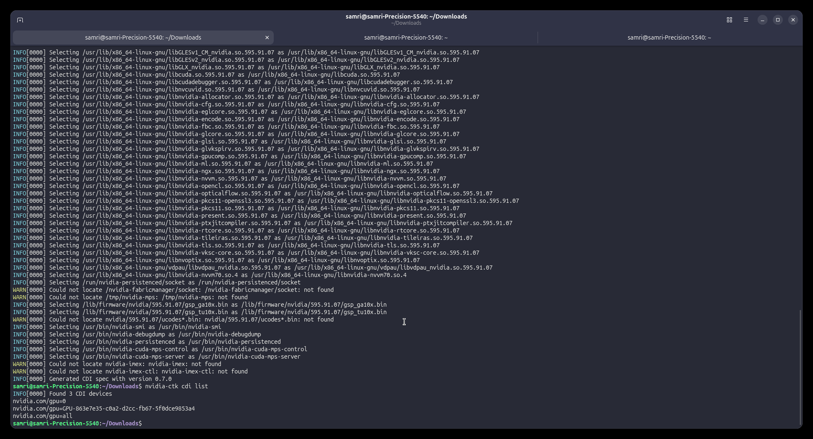

</details>

> [!NOTE]
> If you ever **update your NVIDIA driver**, re-run the `nvidia-ctk cdi generate` command above, or the container may lose GPU access.

---

## 7. Create the Ubuntu 24.04 Container

🖥️ **HOST**

Now create the container. We name it **`ros-jazzy`**, and the rest of this guide uses that name.

**With an NVIDIA GPU:**
```bash
distrobox create \
  --name ros-jazzy \
  --image docker.io/library/ubuntu:24.04 \
  --additional-flags "--device nvidia.com/gpu=all"
```

**Without an NVIDIA GPU:**
```bash
distrobox create \
  --name ros-jazzy \
  --image docker.io/library/ubuntu:24.04
```

When asked `Do you want to pull the image now? [Y/n]`, type **`y`** and press Enter. The command downloads Ubuntu 24.04 and creates the container. When it finishes, you should see `Distrobox 'ros-jazzy' successfully created.`

<details>
<summary>📷 Example output</summary>

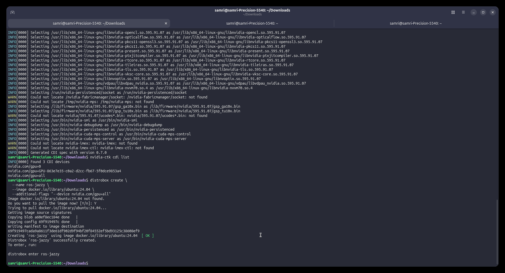

</details>

---

## 8. Customize Your Terminal Prompt

🖥️ **HOST**

Because the container and the host look almost identical in the terminal, it's easy to lose track of which one you're in. This step changes your prompt so container terminals start with **`[BOX:ros-jazzy]`**. It also **automatically loads ROS** whenever you're in the container, so you don't have to remember to.

This works because the container shares your home folder, including your terminal settings file `~/.bashrc`. The code below checks "am I in a container?" and behaves differently in each case.

1. Open the settings file in **nano**, a simple text editor that runs inside the terminal:
   ```bash
   nano ~/.bashrc
   ```

   <details>
   <summary>📷 Screenshot: nano editor</summary>

   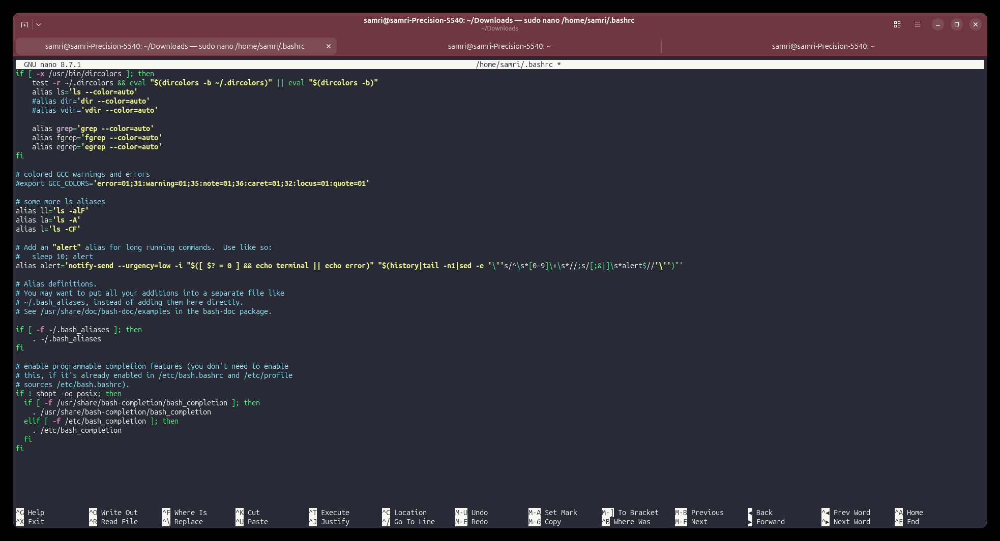

   </details>

2. Scroll to the **very bottom** of the file using the arrow keys, or press `Alt` + `/` to jump there.

3. Paste the following at the bottom (with `Ctrl` + `Shift` + `V`):
   ```bash
   ## --- ROS + environment detection (host vs Distrobox) ---
   if [ -n "$container" ]; then

       if [ -f /opt/ros/jazzy/setup.bash ]; then
           source /opt/ros/jazzy/setup.bash
       fi

       BOLD=$'\[\e[1m\]'
       BLUE="$(tput setaf 4)"
       CYAN="$(tput setaf 6)"
       RESET="$(tput sgr0)"

       PS1="${BOLD}[${CYAN}BOX:${CONTAINER_ID:-container}${RESET}${BOLD}]${RESET} $PS1"

   else
       if [ -f /opt/ros/lyrical/setup.bash ]; then
           source /opt/ros/lyrical/setup.bash
       fi
   fi
   ```

   > What this does:
   > - **In the container:** loads ROS 2 Jazzy (once it's installed) and adds the `[BOX:ros-jazzy]` label to your prompt.
   > - **On the host:** loads ROS 2 *Lyrical* if you ever install it natively on Ubuntu 26.04. You don't need it for this guide, and it does nothing if Lyrical isn't installed.

4. **Save and exit:** press `Ctrl` + `S` to save, then `Ctrl` + `X` to exit.

---

## 9. Enter the Container for the First Time

🖥️ **HOST** → 📦 **CONTAINER**

```bash
distrobox enter ros-jazzy
```

**The first time takes a few minutes**, because Distrobox sets up the container (you'll see a list of `[ OK ]` steps). Later entries take only a second or two.

<details>
<summary>📷 Example output (first entry)</summary>

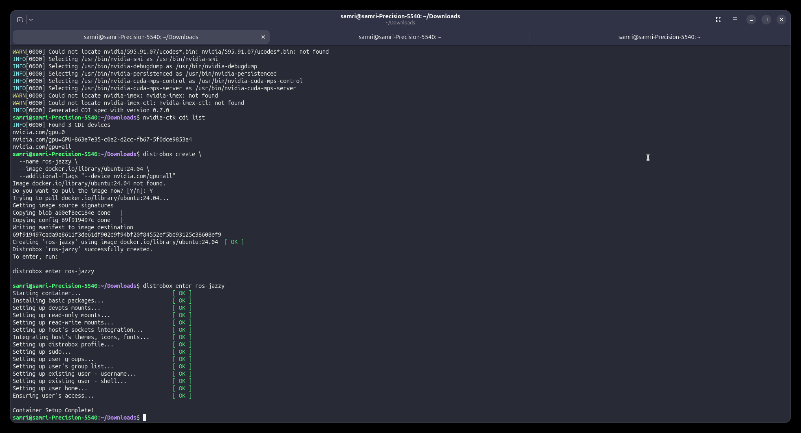

</details>

Once inside, your prompt starts with **`[BOX:ros-jazzy]`**. You're now inside Ubuntu 24.04.

<details>
<summary>📷 Screenshot: the container prompt</summary>

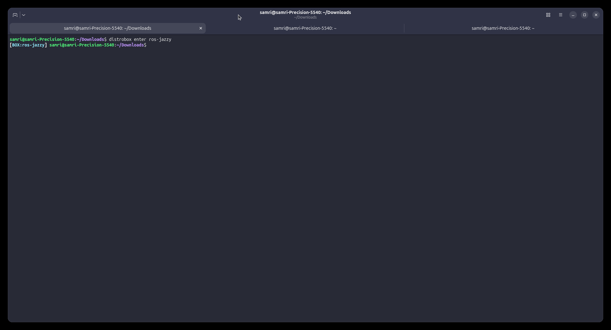

</details>

📦 **CONTAINER**: Run some quick checks:

```bash
cat /etc/os-release
```
This should say `Ubuntu 24.04...` (`noble`), which confirms you're in the container.

**NVIDIA users only:**
```bash
nvidia-smi
ls -l /dev/nvidia*
```
`nvidia-smi` should show the same GPU table you saw on the host, and `ls` should list several `/dev/nvidia...` devices. If both work, the GPU passthrough is working.

<details>
<summary>📷 Example output</summary>

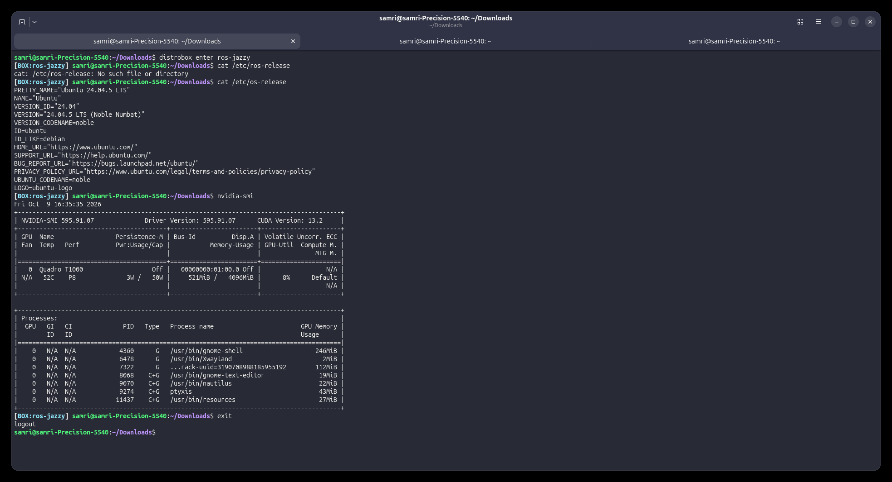

</details>

Now update the container's software:
```bash
sudo apt update
sudo apt upgrade
```

> [!NOTE]
> **To leave the container**, type `exit` (or press `Ctrl` + `D`). You'll return to the host prompt. **To get back in**, run `distrobox enter ros-jazzy` again. Everything you installed in the container stays there.
>
> Your **home folder is shared**, so files you create in `~` inside the container are visible on the host, and vice versa. **Software you install in the container stays in the container** and doesn't affect your host.

---

## 10. Install ROS 2 Jazzy in the Container

📦 **CONTAINER** (your prompt should start with `[BOX:ros-jazzy]`)

These steps follow the [official ROS 2 Jazzy install guide](https://docs.ros.org/en/jazzy/Installation/Ubuntu-Install-Debians.html).

### 10a. Enable the "universe" software source
```bash
sudo apt install software-properties-common
sudo add-apt-repository universe
```
If it says `Press [ENTER] to continue`, press Enter.

<details>
<summary>📷 Example output</summary>

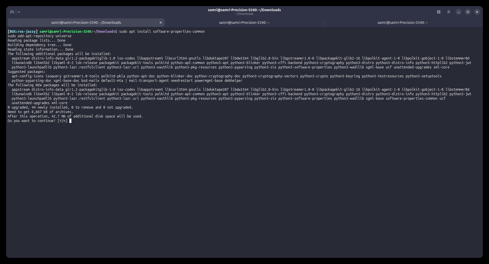

</details>

> You may see some scary-looking lines like `invoke-rc.d: policy-rc.d denied execution` or `Failed to connect to socket /run/dbus/...`. **These are normal inside a container** and can be ignored.

### 10b. Add the ROS 2 software source
Copy and paste these lines all together:
```bash
sudo apt update && sudo apt install curl -y
export ROS_APT_SOURCE_VERSION=$(curl -s https://api.github.com/repos/ros-infrastructure/ros-apt-source/releases/latest | grep -F "tag_name" | awk -F'"' '{print $4}')
curl -L -o /tmp/ros2-apt-source.deb "https://github.com/ros-infrastructure/ros-apt-source/releases/download/${ROS_APT_SOURCE_VERSION}/ros2-apt-source_${ROS_APT_SOURCE_VERSION}.$(. /etc/os-release && echo ${UBUNTU_CODENAME:-${VERSION_CODENAME}})_all.deb"
sudo dpkg -i /tmp/ros2-apt-source.deb
```
The last lines of output should mention `Setting up ros2-apt-source`.

<details>
<summary>📷 Example output</summary>

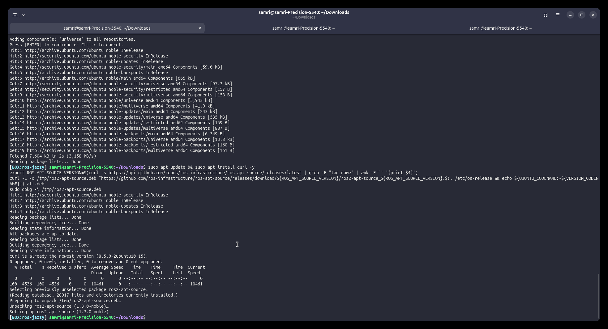

</details>

### 10c. Install the ROS development tools
```bash
sudo apt update && sudo apt install ros-dev-tools -y
```
This installs build tools such as `colcon`, `rosdep`, compilers, and `git`.

<details>
<summary>📷 Example output</summary>

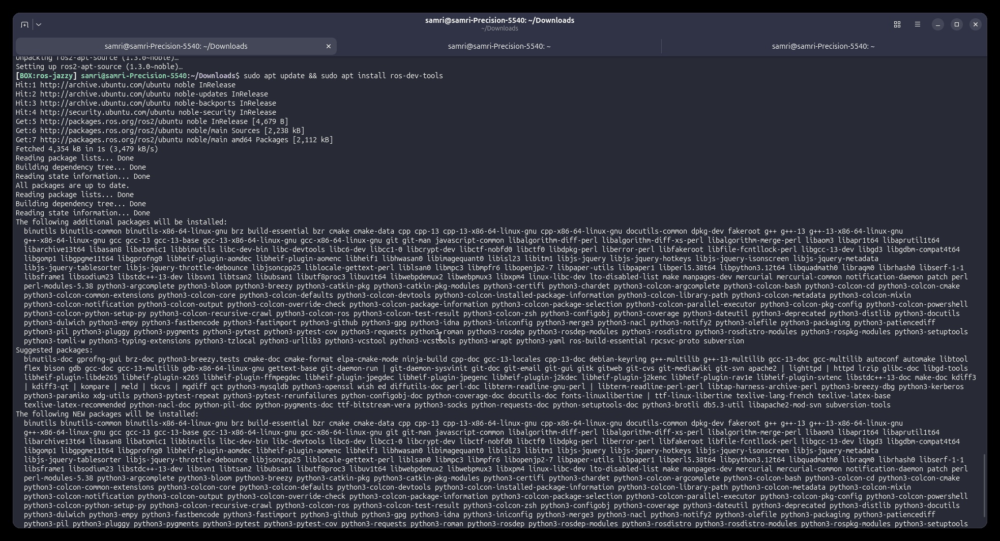

</details>

### 10d. Install ROS 2 Jazzy
```bash
sudo apt install ros-jazzy-ros-base -y
```
This is a big download, so give it a few minutes.

<details>
<summary>📷 Example output</summary>

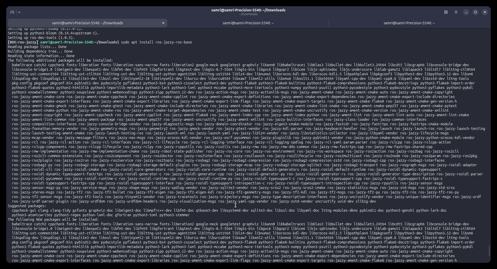

</details>

### 10e. Verify ROS works
The `.bashrc` changes from [step 8](#8-customize-your-terminal-prompt) only load ROS when a **new** terminal starts. Reload them now:
```bash
source ~/.bashrc
```
Then check:
```bash
printenv | grep ROS
```
You should see lines including `ROS_DISTRO=jazzy` and `ROS_VERSION=2`.

```bash
ros2 pkg list
```
This should print a long list of package names. If it does, ROS is installed. 🎉

---

## 11. Download the LANCE Code

📦 **CONTAINER**

The steps from here on mostly follow the project's [`README.md`](../README.md), with extra explanation added.

### 11a. Install Git LFS
The simulation repo stores large 3D models using **Git LFS** ("Large File Storage"). Install it **before** cloning, so the large files download automatically:
```bash
sudo apt install git-lfs
git lfs install
```

### 11b. Create the workspace and clone the main repo
A ROS "workspace" is a folder that holds your code in a subfolder named `src`. We'll put it at `~/code/lance-ws`; you can choose another location, but the rest of this guide assumes this one.

```bash
mkdir -p ~/code/lance-ws
cd ~/code/lance-ws
git clone --recurse-submodules -b main https://github.com/Cardinal-Space-Mining/lance-2026 src
```
The repo downloads **into a folder named `src`**. `--recurse-submodules` also downloads the other repos this project includes.

> If you forgot `--recurse-submodules`, or need to update the submodules later, run this from inside `~/code/lance-ws/src`:
> ```bash
> git submodule update --init --recursive
> ```

### 11c. Clone the simulation repo
> [!IMPORTANT]
> **Clone `csm-sim` before installing dependencies in step 12.** The simulation package is what tells `rosdep` to install **Gazebo**. If it isn't there yet, Gazebo won't get installed.

```bash
cd ~/code/lance-ws/src
git clone https://gitlab.com/csm2.0/csm-sim
cd ~/code/lance-ws
```

Check that the large files were actually downloaded:
```bash
cd ~/code/lance-ws/src/csm-sim
git lfs ls-files
```
Each file in the list should have a `*` after its ID (meaning it's downloaded), not a `-`. If you see `-`, or you cloned before installing Git LFS, fetch them manually **from inside the `csm-sim` folder**:
```bash
git lfs fetch
git lfs checkout
```
Then return to the workspace:
```bash
cd ~/code/lance-ws
```

> `csm-sim` has its own README with Isaac Sim/Gazebo background. You don't need to follow it for this guide, because everything it requires is covered here.

Your workspace should now look like this:
```
~/code/lance-ws/
└── src/
    ├── README.md
    ├── build.sh
    ├── run.sh
    ├── csm-sim/
    ├── lance/
    ├── cardinal-perception/
    └── ... (other packages)
```

---

## 12. Install Project Dependencies (and Gazebo)

📦 **CONTAINER**: Run everything from `~/code/lance-ws`:
```bash
cd ~/code/lance-ws
```

### 12a. Install ROS dependencies with rosdep
`rosdep` reads every package in the workspace and installs whatever each one needs. **This is the step that installs Gazebo**, through the `csm-sim` package.

First-time setup only:
```bash
sudo rosdep init
rosdep update
```
> If `sudo rosdep init` says the file `already exists`, that's fine. Just continue with `rosdep update`.

Then install everything:
```bash
rosdep install --ignore-src --from-paths src -r -y
```
This can take a while, since it downloads a lot of packages.

### 12b. Add extra software sources
Some libraries come from outside Ubuntu's normal sources, so add those sources first.

**Phoenix 6** (motor controller library from CTR Electronics):
```bash
YEAR=2026
sudo curl -s --compressed -o /usr/share/keyrings/ctr-pubkey.gpg "https://deb.ctr-electronics.com/ctr-pubkey.gpg"
sudo curl -s --compressed -o /etc/apt/sources.list.d/ctr${YEAR}.list "https://deb.ctr-electronics.com/ctr${YEAR}.list"
```

**OSRF/Gazebo source** (used here to get the `zenoh` networking libraries):
```bash
sudo curl https://packages.osrfoundation.org/gazebo.gpg --output /usr/share/keyrings/pkgs-osrf-archive-keyring.gpg
echo "deb [arch=$(dpkg --print-architecture) signed-by=/usr/share/keyrings/pkgs-osrf-archive-keyring.gpg] https://packages.osrfoundation.org/gazebo/ubuntu-stable $(lsb_release -cs) main" | sudo tee /etc/apt/sources.list.d/gazebo-stable.list > /dev/null
```

### 12c. Install the remaining packages
```bash
sudo apt update
sudo apt install libpcl-dev libopencv-dev python3-netifaces phoenix6 patchelf libzenohc-dev libzenohcpp-dev
```

---

## 13. Build the Project

📦 **CONTAINER**: From `~/code/lance-ws`:
```bash
cd ~/code/lance-ws
./src/build.sh
```

The first build takes a **long time** (possibly 10+ minutes, depending on your computer). You'll see lots of text scroll by. Yellow **warnings** are normal. When it finishes, you should see:
```
>> Build finished in XXX seconds.
```

> [!TIP]
> Some code is compiled twice, once for each robot (LANCE-1 and LANCE-2). If you only care about one robot, you can roughly halve the build time:
> - `./src/build.sh --l1`: build for LANCE-1 only
> - `./src/build.sh --l2`: build for LANCE-2 only
>
> The build script also automatically uses fewer parallel jobs when your computer is low on free memory, to avoid crashing.

The build creates three new folders next to `src`: `build/`, `install/`, and `log/`. You don't need to touch them. To wipe them and start fresh, run `./src/build.sh --clean`.

---

## 14. Run the Simulation

### 14a. Start the simulation
📦 **CONTAINER**: From `~/code/lance-ws`:
```bash
./src/run.sh gz_full:=lance2_ksc gz_gui:=enabled
```
This launches Gazebo with **LANCE-2 in the KSC arena**, along with the full robot software stack and a Foxglove connection. A Gazebo window should open on your desktop. The first launch can take a minute or so.

> [!NOTE]
> By default, the simulator runs **headless** (no Gazebo window). `gz_gui:=enabled` opens the 3D view. You can leave it off to save resources and use Foxglove alone, which is handy on slower laptops.

Other simulation options follow the pattern `<mode>:=<robot>_<arena>`:

| Mode | What it runs |
| - | - |
| `gz_full` | Simulator + robot code + client code (everything) |
| `gz_robot` | Simulator + robot code only |
| `gz_client` | Simulator + client code only |

| Robot / arena options |
| - |
| `lance1_ksc`, `lance1_ucf_left`, `lance1_ucf_right` |
| `lance2_ksc`, `lance2_ucf_left`, `lance2_ucf_right` |

For example: `./src/run.sh gz_full:=lance1_ucf_left gz_gui:=enabled`. All presets are defined in [`lance/config/presets/`](../lance/config/presets/). See the [README](../README.md#running) for robot/client (non-simulation) examples and the `--local` / `--canbus` flags.

**To stop the simulation**, click into the terminal and press `Ctrl` + `C`.

### 14b. Connect Foxglove
🖥️ **HOST**: Foxglove runs on the host, not in the container.

1. Open Foxglove.
2. Click **Open connection**, keep the **Foxglove WebSocket** option, use the URL `ws://localhost:8765`, and click **Open**.
3. Load the project's dashboard layout: click the **Layout** dropdown (top-right), choose **Import from file...**, and select:
   ```
   ~/code/lance-ws/src/foxglove_layout.json
   ```
   (In the file picker, press `Ctrl` + `H` to show hidden folders if needed, or type the path directly.)

You should now see live data from the simulated robot. 🚀

---

## 15. Everyday Workflow Cheat Sheet

Once everything is set up, a typical session looks like this:

```bash
# 🖥️ HOST: open a terminal, then enter the container
distrobox enter ros-jazzy

# 📦 CONTAINER: go to the workspace
cd ~/code/lance-ws

# Pull the latest code (optional)
cd src && git pull && git submodule update --init --recursive && cd ..

# Build after any code change
./src/build.sh

# Run
./src/run.sh gz_full:=lance2_ksc gz_gui:=enabled
```

- **Edit code** in VS Code on the host: open the `~/code/lance-ws` folder (`code ~/code/lance-ws`). See the [VSCode section of the README](../README.md#vscode) for IntelliSense and formatting settings.
- **Build and run** inside the container.
- **View data** in Foxglove on the host.
- **Each new terminal tab starts on the host.** Run `distrobox enter ros-jazzy` in every tab where you need ROS.

---

## 16. Troubleshooting

<details>
<summary><b><code>ros2: command not found</code> (inside the container)</b></summary>

- Make sure you're actually **in the container**. Your prompt should start with `[BOX:ros-jazzy]`. If it doesn't, run `distrobox enter ros-jazzy`.
- Run `source ~/.bashrc`, or exit and re-enter the container.
- Check that the snippet from [step 8](#8-customize-your-terminal-prompt) is at the bottom of `~/.bashrc`.
</details>

<details>
<summary><b><code>nano: command not found</code> (inside the container)</b></summary>

`nano` isn't installed in the container by default. Either edit the file from a **host** terminal (it's the same file, since the home folder is shared), or install nano in the container with `sudo apt install nano`.
</details>

<details>
<summary><b><code>nvidia-smi</code> fails inside the container, or Gazebo is very slow</b></summary>

1. Confirm `nvidia-smi` works on the **host**. If it doesn't, revisit [step 4](#4-install-nvidia-drivers-nvidia-gpus-only) (and check the Secure Boot/MOK note).
2. Re-generate the CDI spec on the host (needed after every driver update):
   ```bash
   sudo nvidia-ctk cdi generate --output=/etc/cdi/nvidia.yaml
   ```
3. If you created the container **without** the `--additional-flags "--device nvidia.com/gpu=all"` option, delete and recreate it (on the host):
   ```bash
   distrobox rm ros-jazzy
   ```
   Then redo [step 7](#7-create-the-ubuntu-2404-container) and onward. **Your files in `~` are safe**, but you'll need to reinstall the software inside the container (steps 9, 10, and 12).
</details>

<details>
<summary><b>Gazebo models look broken or missing / errors about invalid mesh files</b></summary>

The Git LFS files probably weren't downloaded. From inside `~/code/lance-ws/src/csm-sim`:
```bash
git lfs install
git lfs fetch
git lfs checkout
```
Then rebuild.
</details>

<details>
<summary><b>The build fails with "package not found" / missing dependency errors</b></summary>

Re-run the dependency steps from `~/code/lance-ws`:
```bash
rosdep update
rosdep install --ignore-src --from-paths src -r -y
```
Also double-check that the apt packages from [step 12c](#12c-install-the-remaining-packages) installed without errors.
</details>

<details>
<summary><b>The build freezes or the computer becomes unresponsive</b></summary>

The build ran out of memory. Close other programs (especially browsers), then build only one robot version with `./src/build.sh --l2` (or `--l1`). You can also limit parallel jobs manually:
```bash
MAKEFLAGS="-j 2" ./src/build.sh --l2
```
</details>

<details>
<summary><b>Foxglove can't connect to <code>ws://localhost:8765</code></b></summary>

- Make sure the simulation is **running** in a container terminal and hasn't exited with an error. Scroll up in that terminal to check.
- Use a preset that enables the Foxglove bridge (all the `gz_*` presets do).
</details>

---

*Written for Ubuntu 26.04 host + Ubuntu 24.04 distrobox + ROS 2 Jazzy. Last updated: 10/9/26*
